CUDA Path Tracer
================

**University of Pennsylvania, CIS 565: GPU Programming and Architecture, Project 3**

* Xinran Tao
  - [LinkedIn](https://www.linkedin.com/in/xinran-tao/), [Personal Website](https://www.xinrantao.com/), [GitHub](https://github.com/theBoilingPoint).
* Tested on:
  - Windows 11, Intel(R) Core(TM) Ultra 9 285H @ 2.90 GHz, RAM 32 GB, GeForce RTX 5090 Laptop GPU 24 GB

# Introduction
This project showcases an advanced CUDA path tracer with surface, spectral, mesh, and sparse volumetric rendering features.

Below are two versions of the final renders. The scene file can be found at `./scenes/jsons/final_scene/final.json`.

|||
|:--:|:--:|
|**The Lonely Bathroom**|**The Neon Bathroom**|

The only difference between the two images is that the walls of the first one uses a microfacet material:
```json
"wall":
{
    "TYPE":"Microfacet",
    "RGB":[0.99215686, 0.82352941, 0.28235294],
    "SPEC_RGB":[1.0, 1.0, 1.0],
    "ROUGHNESS": 0.8,
    "IOR": 1.5
}
```
whereas those of the second one uses a light material:
```json
"wall":
{
    "TYPE":"Emitting",
    "RGB":[0.99215686, 0.82352941, 0.28235294],
    "EMITTANCE":1.0
}
```
For the rest of the scene, the both the ceiling and the floor use microfacet materials. The mesh (the sink and the bathtub) is loaded from a .glb file with its default textures and uses a diffuse material. The bubbles are dielectrics with index of refraction 1.33. Furthermore, we have a big white light hanging on the ceiling and a mirror on the left wall. Additionally, the depth of field (DOF) effect can be seen at the blurrred bubbles.

# Build Instructions

## Quick Start (Recommended)

**Prerequisites:** install [Ninja](https://ninja-build.org/) (`winget install Ninja-build.Ninja`).

Run the build script from the project root:
```bat
scripts\build.bat
```
This will:
1. Configure and build the project using the Visual Studio 2026 generator (produces `build/cis565_path_tracer.slnx`)
2. Run a second CMake configure with Ninja to generate `compile_commands.json` for clangd
3. Copy `compile_commands.json` into `build/` and remove the temporary Ninja build folder

Open `build/cis565_path_tracer.slnx` in Visual Studio to run.

## Manual Build (Without the Script)

If you prefer to run the steps yourself, open **x64 Native Tools Command Prompt for VS 2026** (search in Start Menu — make sure it says **x64**), then run:
```bat
cmake -S . -B build -G "Visual Studio 18 2026"
```
Open `build/cis565_path_tracer.slnx` in Visual Studio to build and run.

> **Why x64 Native Tools?** NVCC requires MSVC's `cl.exe` as its host compiler, targeting x64. The regular "Developer PowerShell" defaults to x86 and causes CUDA compiler detection to crash. Always use the x64 variant.

### clangd (code intelligence)
This project uses [clangd](https://clangd.llvm.org/) for code intelligence (autocomplete, go-to-definition, diagnostics). clangd requires a `compile_commands.json` file, which the Visual Studio generator does not produce. A separate Ninja configuration is used solely to generate this file — the VS solution in `build/` remains the one used for building.

From the same **x64 Native Tools Command Prompt for VS 2026**, run:
```bat
cmake -S . -B build_ninja -G Ninja -DCMAKE_BUILD_TYPE=Debug -DCMAKE_EXPORT_COMPILE_COMMANDS=ON
copy build_ninja\compile_commands.json build\compile_commands.json
rmdir /S /Q build_ninja
```
`compile_commands.json` is produced during the configure step — no build required.

# Basic Features
## Simple BRDFs
Both images are generated after 1000 iterations.

### Diffuse
A diffse material should be define in json like this:
```json
"diffuse_white": 
{
  "TYPE":"Diffuse",
  "RGB":[0.98, 0.98, 0.98]
}
```

Below is the image of the default Cornell box scene with a diffuse material. 

||
|:--:|
|**Diffuse Material**|

The average time for each frame is 500 ms and the FPS is 2.0.

### Mirror
A mirror material should be define in json like this:
```json
"mirror": 
{
  "TYPE": "Mirror",
  "SPEC_RGB": [1.0,1.0,1.0]
}
```

Below is the image of the default Cornell box scene with a mirror material.

||
|:--:|
|**Mirror Material**|

The average time for each frame is 533.5 ms and the FPS is 1.9.

## Performance/Visual Improvements
> - The scene file to test **stream compaction** and **matwrial sort** features is in `../scenes/jsons/test_performance/`. Remember to replace the path to the meshes and textures with the absolute path on your machine.
> - The scene file to test **antialiasing** is the default cornell box scene.

For each of the experiments conducted in this section, the number of iterations is set to 500. When testing each feature, the other two features are turned on for faster result generation.

### Stream Compaction
To better analyze the performance improvements brought about by stream compaction in the context of path tracing, we can look at the percentage reduction in rendering times across different scene complexities and triangle counts. This allows us to quantify the efficiency gains more precisely and see how stream compaction scales with scene complexity.


#### Closed Scene Analysis
For the closed scene, stream compaction shows significant improvements as the complexity (triangle count) increases:

- **At 960 triangles**, the reduction in time per frame from 2,414.80 ms without stream compaction to 960.00 ms with stream compaction translates to an improvement of approximately 60.2%.
- **At 5,760 triangles**, the time decreases from 15,877.50 ms to 5,760.00 ms, which is an improvement of about 63.7%.
- **At 23,040 triangles**, there is a reduction from 61,907.50 ms to 24,141.30 ms, resulting in an improvement of approximately 61.0%.

These improvements demonstrate that stream compaction becomes more effective as the number of triangles increases, consistently offering around a 60% decrease in rendering time in closed environments. This consistent performance enhancement underscores the effectiveness of stream compaction in managing ray interactions in denser geometries where rays are likely to remain within the scene longer.

#### Open Scene Analysis
In the open scene, the performance gains from stream compaction are even more pronounced, especially at higher complexities:

- **At 960 triangles**, the time reduction from 568.90 ms without stream compaction to 260.37 ms with stream compaction results in an improvement of approximately 54.2%.
- **At 5,760 triangles**, the time decreases from 14,278.82 ms to 2,863.59 ms, showing an improvement of around 79.9%.
- **At 23,040 triangles**, there is a dramatic reduction from 55,210.47 ms to 9,281.79 ms, which translates to an improvement of approximately 83.2%.

The more substantial percentage improvements in the open scene can be attributed to the higher likelihood of rays escaping or becoming ineffective quickly due to less complex interactions with scene elements. Stream compaction effectively eliminates these non-contributing rays early, thereby significantly reducing computational waste.

#### Conclusion
Overall, stream compaction offers substantial performance enhancements, particularly in open scenes where many rays do not significantly interact with the scene elements. The technique is highly scalable, showing greater benefits as the number of triangles and scene complexity increase. By focusing computational resources on rays that significantly contribute to the final image, stream compaction makes path tracing more efficient and viable for complex scenes, particularly in real-time applications.

### Sorting Paths by Material


The performance chart provided indicates the impact of material sorting on the rendering time of scenes at various levels of complexity, measured by triangle counts. Material sorting is a technique used in path tracing to optimize the shading step by making rays, path segments, or intersections contiguous in memory by material type. This strategy aims to streamline the computation process during the shading phase by grouping similar materials together, potentially reducing the overhead associated with switching between different material types.

#### Performance Improvements Quantified

From the data provided in the chart:
- **At 960 triangles**, the rendering time with material sort is 2,414.80 ms compared to 2,324.50 ms without material sort, showing a slight increase in time by about 3.9%. This indicates that at lower complexities, the overhead of sorting may not be justified by the performance gains in shading.
- **At 5,760 triangles**, the time with material sort is 11,202.00 ms compared to 11,536.40 ms without material sort, resulting in a performance improvement of about 2.9%. As the scene complexity increases, material sorting starts to show benefits, likely due to more significant material diversity and the increasing impact of efficient shading.
- **At 23,040 triangles**, the time with material sort is 24,141.30 ms compared to 32,292.10 ms without material sort, which translates to a significant improvement of about 25.2%. At this level of complexity, the benefits of material sorting are most pronounced, likely due to a large variety of materials that can cause more severe computational overhead when not sorted.

#### Analysis

The results demonstrate that material sorting can lead to significant performance improvements, especially in more complex scenes with a higher variety of materials. The minor performance degradation observed in very simple scenes suggests that the overhead of sorting might not always be beneficial when the material complexity and diversity are low. However, as the complexity increases, material sorting effectively reduces the time taken per frame by improving the efficiency of BSDF evaluations during shading, making it a worthwhile optimization for complex, material-diverse scenes in path tracing. This approach aligns well with optimizations aimed at reducing divergence in GPU computations and enhancing memory access patterns, which are crucial for achieving high performance in graphics rendering.

### Antialiasing
Below are the images showcasing the antialiasing feature. Both images are rendered with 500 iterations.

|||
|:--:|:--:|
|**With Antialiasing**|**Without Antialiasing**|

|||
|:--:|:--:|
|**Zoom With Antialiasing**|**Zoom Without Antialiasing**|

We can see that with antialiasing, the edges of the objects are smoother and the image is less noisy. Given that this feature is implemented by jittering the rays once when the camera is generating them, it does not add much overhead to the rendering process. The average time for each frame is around 550 ms with and without antialiasing. The FPS is 2.0 for both cases.

# Advanced Features
## Visual Improvements
All visual improvements closely follow the theories in *Physically Based Rendering: From Theory to Implementation (PBRT)*.

### Dielectric (Refraction)
To use a dielectric material, the following json should be defined in the scene file:
```json
"dielectric_white": 
{
  "TYPE": "Dielectric",
  "SPEC_RGB": [1.0,1.0,1.0],
  "IOR": 1.5
}
```
where `SPEC_RGB` is the colour of the material and `IOR` is the index of refraction.

The following image is rendered using the scene file `./scenes/jsons/test_materials/cornell_dielectrics__diffSpecCol.json`. The `IOR` is 1.5 for all spheres.

||
|:--:|
|**Dielectric Material with Different SPEC_RGB**|

The following image is rendered using the scene file `./scenes/jsons/test_materials/cornell_dielectrics__diffIOR.json`. The `IOR` used from the leftmost sphere to the rightmost one are 1.2, 1.4, 1.6, and 1.8.

||
|:--:|
|**Dielectric Material with Different IOR**|

### Microfacet Material
To use a microfacet material, the following json should be defined in the scene file:
```json
"microfacet": 
{
  "TYPE": "Microfacet",
  "RGB": [0.5,0.5,0.5],
  "SPEC_RGB": [1.0,1.0,1.0],
  "ROUGHNESS": 0.6,
  "IOR": 1.5
}
```

The following image is rendered using the scene file `./scenes/jsons/test_materials/cornell_microfacets.json`. The `ROUGHNESS` used from the leftmost sphere to the rightmost one are 0.01, 0.3, 0.6, and 0.9.

||
|:--:|
|**Microfacet Material with Different Roughness**|

We can see that as the roughness increases, the reflection becomes more diffuse.

### Depth of Field (DOF)
To enable DOF, the following properties should be defined for the camera in the scene file:
```json
"FOCAL_DISTANCE": 4.0,
"LENS_RADIUS": 0.4
```

Below are the images rendered using the scene file `./scenes/jsons/test_dof/cornell.json`.

The set of images below vary the `FOCAL_DISTANCE` from 2.0 to 8.0 with a fixed `LENS_RADIUS` of 0.2.

|||
|:--:|:--:|
|**Radius 0.2, Distance 2.0**|**Radius 0.2, Distance 4.0**|

|||
|:--:|:--:|
|**Radius 0.2, Distance 6.0**|**Radius 0.2, Distance 8.0**|

The set of images below vary the `LENS_RADIUS` from 0.1 to 0.4 with a fixed `FOCAL_DISTANCE` of 4.0.

|||
|:--:|:--:|
|**Radius 0.1, Distance 4.0**|**Radius 0.2, Distance 4.0**|

|||
|:--:|:--:|
|**Radius 0.3, Distance 4.0**|**Radius 0.4, Distance 4.0**|

### Texture Loading with Arbitrary Mesh
The cover image is a good example of texture loading. A simple procedural texture `checkerboard` is also implemented in `pathtrace.cu`. You can toggle this texture by setting `USE_CHECKERBOARD_TEXTURE` on top of the file.

Below is the cover image rendered with the checkerboard texture.
||
|:--:|
|**The Neon Bathroom with Checkerboard Texture**|

To use this feature, you must provide a mesh with UV coordinates. There are two ways of loading a mesh with textures. 
The first way is to define a textures like so in the scene file:
```json
"Textures": {
  "albedo":
  {
      "TYPE":"Albedo",
      "TEXTURE_PATH":"{absolute_path_to_texture}"
  },
  "bump":
  {
      "TYPE":"Bump",
      "TEXTURE_PATH":"{absolute_path_to_texture}"
  }
}
```
and to use a texture, you need to set it when you are defining your geometry:
```json
{
  "TYPE":"mesh",
  "MESH_PATH":"{absolute_path_to_mesh}",
  "MATERIAL":"mirror",
  "TEXTURES": ["albedo", "bump"],
  "TRANS":[0.0,5.0,0.0],
  "ROTAT":[0.0,0.0, 0.0],
  "SCALE":[1.0,1.0,1.0]
}
```
And this is the default way of loading textures. The second way is simply load a `.glb/gltf` file and its textures will be read and used. To toggle between the features, set the `USE_SELF_LOADED_TEXTURES` on top of the `scene.cpp` file.

#### Analysis of Performance Impact


**At 960 Triangles:**
- **With Texture Loading:** The time per frame is 3,016.80 milliseconds.
- **With Checkerboard:** The time per frame is 2,988.54 milliseconds.
- **Performance Improvement:** The checkerboard procedural texture shows a slight improvement of about 0.94% compared to traditional texture loading. At this low complexity, the difference is minimal, suggesting that both methods handle low triangle counts with almost equal efficiency.

**At 5,760 Triangles:**
- **With Texture Loading:** The time per frame is 15,186.63 milliseconds.
- **With Checkerboard:** The time per frame is 14,357.98 milliseconds.
- **Performance Improvement:** At this intermediate level of complexity, using a procedural checkerboard texture improves performance by about 5.45%. This more noticeable improvement can be attributed to the procedural method's efficiency in memory usage and possibly less overhead in fetching and applying texture data compared to file-based textures.

**At 23,040 Triangles:**
- **With Texture Loading:** The time per frame is 35,450.50 milliseconds.
- **With Checkerboard:** The time per frame is 30,036.50 milliseconds.
- **Performance Improvement:** Here, the procedural checkerboard texture offers a significant performance enhancement of about 15.27%. As the scene complexity increases, the benefits of using a procedural texture become more pronounced. This improvement is likely due to the reduced computational overhead of procedural textures, which do not require reading from external files and can be generated on-the-fly, thereby reducing memory bandwidth and storage requirements.

##### Conclusions Drawn from the Data

The data illustrates that procedural texture generation, like a checkerboard pattern, tends to offer better performance as scene complexity increases. This is because procedural textures are computed mathematically at runtime and typically require less memory and computational resources than traditional textures, which need to be loaded from disk, stored in memory, and then mapped onto surfaces.

The performance gains are relatively small at lower triangle counts but become significantly more noticeable as the complexity of the scene increases. This trend suggests that for applications where high scene complexity coincides with intensive texture use, procedural textures can offer substantial performance benefits.

In contrast, traditional texture loading might still be preferred in scenarios where unique and complex texture details are required, and the slightly higher computational cost is justifiable by the visual output quality. However, for applications requiring high performance and scalability, especially in real-time systems, procedural textures offer a compelling advantage.

The choice between procedural texture generation and traditional texture loading should consider both the visual fidelity required and the performance implications, as demonstrated by the observed improvements in rendering times across varying levels of scene complexity.

## Spectral Rendering (Hero-Wavelength Path Tracing)

The renderer can transport light **spectrally** instead of as RGB triples: each path carries radiance at 4 sampled wavelengths, enabling effects RGB transport fundamentally cannot produce — real dispersion (rainbow caustics through glass), physically meaningful light spectra (blackbody, CIE illuminants), and more accurate color mixing.

**Toggle:** `#define SPECTRAL 0|1` in `src/render/spectral.h` (it is a cross-file switch, so it lives in a shared header rather than `pathtrace.cu`'s toggle block). `SPECTRAL 0` reproduces the original RGB renderer **bit-identically**. Rebuild after flipping it — and use a clean rebuild (`cmake --build build --config Release --target cis565_path_tracer --clean-first`), since the VS CUDA integration does not reliably re-track header-only macro flips.

### Technique stack (all open source, quality-first)

| Technique | Source |
|---|---|
| Hero Wavelength Spectral Sampling, N=4 wavelengths/path | [Wilkie et al., EGSR 2014](https://cgg.mff.cuni.cz/publications/hero-wavelength-spectral-sampling/); as in [PBRT-v4](https://pbr-book.org/4ed/Radiometry,_Spectra,_and_Color/Representing_Spectral_Distributions) |
| Visible-wavelength importance sampling (pdf ∝ sech²) | Radziszewski et al. 2009 / PBRT-v4 `SampleVisibleWavelengths` |
| Sigmoid-polynomial spectral uplifting of all RGB assets | [Jakob & Hanika 2019](https://rgl.epfl.ch/publications/Jakob2019Spectral), vendored [rgb2spec](https://github.com/mitsuba-renderer/rgb2spec) (BSD) in `libs/rgb2spec`; the sRGB coefficient table is generated once at build time |
| Illuminant uplift for unbounded emission RGB | PBRT-v4 `RGBIlluminantSpectrum` (scaled sigmoid × D65) |
| Dispersion via 2-term Cauchy IOR from (n_d, Abbe number), hero-only termination at dispersive interfaces | PBRT-v4 dielectric |
| Sensor: CIE 1931 CMFs → XYZ → linear sRGB per iteration | public-domain CIE data (5 nm tables shipped with rgb2spec, resampled to 1 nm) |

RGB enters spectrum-land in exactly two device functions (`upliftReflectance`, `upliftIlluminant` in `pathtrace.cu`) and leaves it in one (`spectrumToRGB` in `finalGather`); in RGB builds all three are identity pass-throughs, so the shading code has no `#ifdef` forest. Direction sampling is driven by the hero wavelength alone, and every lobe except the dispersive dielectric is wavelength-independent, so the existing scalar MIS machinery stays exact (the dispersive dielectric is a delta lobe and terminates the secondary wavelengths, PBRT-style).

### Dispersion

Give a dielectric an Abbe number and its IOR becomes wavelength-dependent (`IOR` is then interpreted as n_d at the 587.6 nm d-line):

```json
"glass_sf11": {
  "TYPE": "Dielectric",
  "SPEC_RGB": [1.0, 1.0, 1.0],
  "IOR": 1.7847,
  "ABBE": 25.68
}
```

Reference Abbe numbers: BK7 crown glass 64.17 (n_d 1.5168), SF11 flint 25.68 (n_d 1.7847), diamond 55.3 (n_d 2.417). Lower Abbe = stronger dispersion. Demo scene: `./scenes/jsons/spectral/spectral_dispersion.json`.

|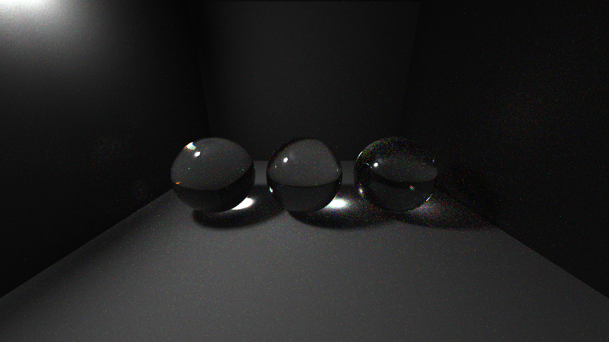|
|:--:|
|**BK7 crown glass, SF11 flint glass and diamond spheres under a small white side light** (spectral build, 2500 spp). Dispersion strength follows the Abbe numbers: the BK7 sphere (left, V=64) stays neutral while SF11 (middle, V=26) and diamond (right, V=55 but much higher IOR) show chromatic sparkle and color-fringed caustics|

|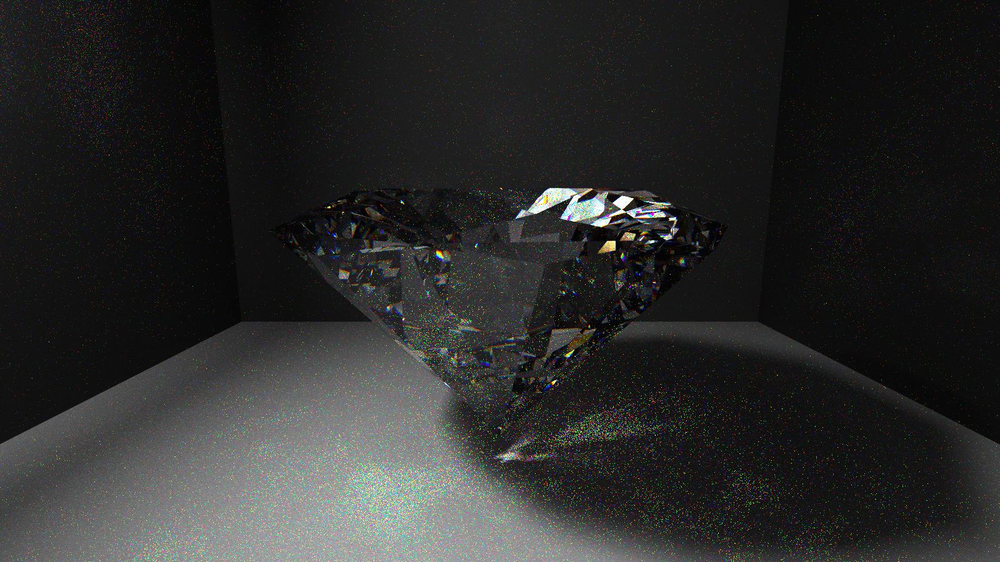|
|:--:|
|**Diamond (`diamond.glb`, n_d 2.417, V 55.3)** — spectral build, 2500 spp, trace depth 16. The colored facet "fire" and the dispersed caustics on the floor come entirely from the wavelength-dependent IOR; the material is plain clear glass with diamond's measured constants (`./scenes/jsons/spectral/spectral_diamond.json`)|

|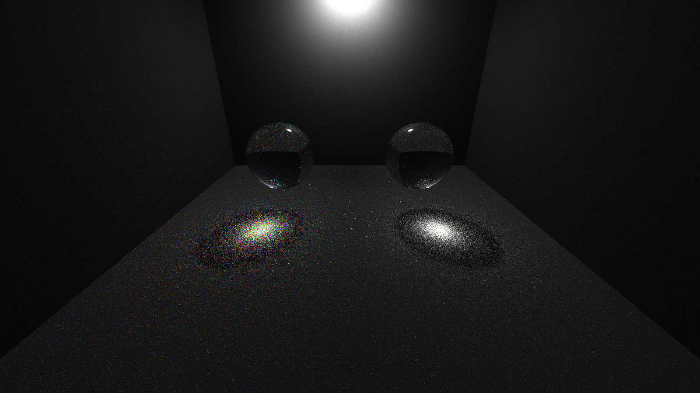|
|:--:|
|**Dispersion correctness proof** (`./scenes/jsons/spectral/spectral_prism_proof.json`, 3000 spp): two identical glass spheres (IOR 1.72) under the same small white light — the left one has Abbe V=10, the right one has dispersion disabled. The left caustic separates into an ordered spectrum while the right stays white; a single-code-path difference (`ABBE` present or not) produces exactly the physical prediction|

|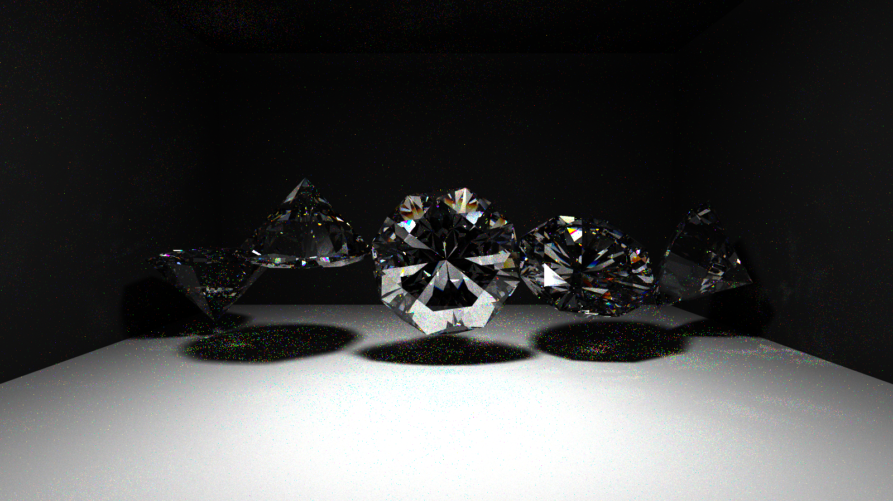|
|:--:|
|**Five diamonds at different orientations** (`./scenes/jsons/spectral/spectral_diamond_angles.json`, 3000 spp): upright, upside-down, lying sideways, and two compound tilts, all with diamond's measured constants. Every orientation shows consistent facet fire and dispersed caustics — a visual regression test for the mesh/refraction/dispersion pipeline (orientation-specific black or garbage facets would indicate normal or refraction bugs)|

### Emission spectra

Emitters (and delta lights) accept an optional `SPECTRUM` field; the RGB stays as a tint on top of the (unit-luminance-normalized) illuminant, so `EMITTANCE` controls brightness consistently across illuminants:

```json
"bulb":      { "TYPE": "Emitting", "RGB": [1,1,1], "EMITTANCE": 8.0, "SPECTRUM": {"BLACKBODY": 1900} },
"sky_panel": { "TYPE": "Emitting", "RGB": [1,1,1], "EMITTANCE": 8.0, "SPECTRUM": "D65" }
```

Supported: `"D65"` (daylight), `"A"` (incandescent, 2856 K), `"E"` (equal energy), `{"BLACKBODY": <kelvin>}` (analytic Planck radiator). In RGB builds the illuminant is folded into the light's RGB tint at scene load, so scenes stay compatible. Demo scene: `./scenes/jsons/spectral/spectral_illuminants.json` (D65 vs. A vs. 1900 K candlelight panels).

|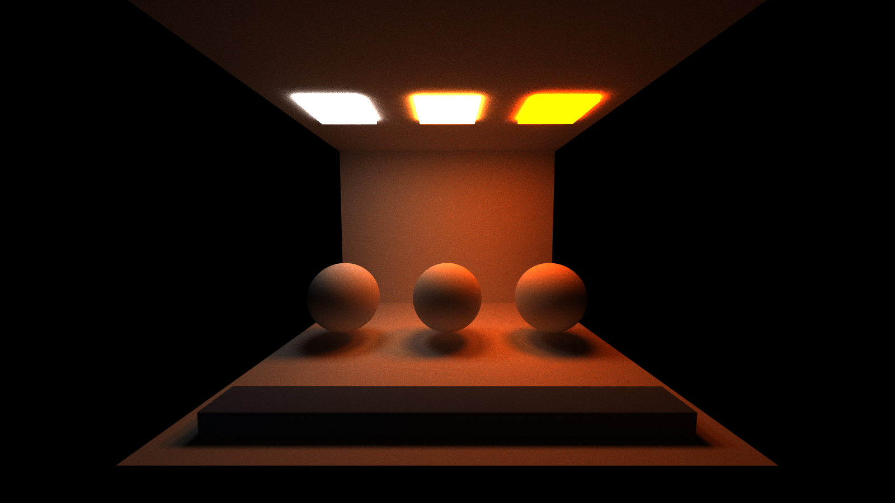|
|:--:|
|**The same white room lit by three light panels: CIE D65 (daylight), CIE A (incandescent) and a 1900 K blackbody (candlelight)** — all with `RGB [1,1,1]` and identical `EMITTANCE`; only the spectrum differs|

### Validation

- `SPECTRAL 0` renders are **bit-identical** to the pre-spectral renderer (SHA-256 compared).
- The GPU port of the rgb2spec fetch/eval is checked at startup against the vendored reference C implementation (max |err| 3.5e-6 over 500 random samples), and a device-side probe verifies the CIE constant tables after upload.
- White-furnace test (gray box, flat spectra): spectral vs. RGB mean abs difference 0.16/255.
- Colored cornell box: 0.93/255 (in-gamut sRGB albedos round-trip through the uplift near-exactly; saturated multi-bounce color bleeding differs slightly — expected, and physically more correct).
- Degenerate-Abbe test (`ABBE: 1e6` vs. no `ABBE`): matches within Monte Carlo noise, confirming the hero-only termination bookkeeping is unbiased.
- Blackbody at 6504 K matches D65 closely; 2700 K and Illuminant A render visibly warm (R > G > B channel means), and the RGB-build fallback tint agrees with the spectral render.

Costs: the path state grows by 32 bytes (wavelengths + pdfs), throughput/radiance become 4-wide, and each shaded hit performs up to three trilinear fetches from the 9.4 MB coefficient table — quality was deliberately prioritized over speed. Spectral noise from wavelength sampling averages out across iterations like any other Monte Carlo dimension.

## Volumetric Rendering (Participating Media)

A cube or sphere with a `Medium` material becomes an invisible null boundary
whose interior can absorb, scatter, and emit light. Sparse combustion grids
use cube boundaries so they can traverse a local axis-aligned brick domain.

### Diagnosis

The original cloud and smoke fields were max-unions of solid spheres. Noise
eroded those unions but could not remove their round scaffold. Optical depths
in the tens made the media nearly opaque, broad frontal lighting flattened
extinction gradients, and the original PNG path clipped linear HDR values.
The cotton-like result therefore came from both density design and scene/output
parameters, not a Henyey-Greenstein sign error or a broken Woodcock tracker.

Revised cloud, fog, and smoke profiles use connected 3-D fields, bounded
multiscale modulation, moderate optical depth, and lighting that reveals
internal extinction. Fire uses stored combustion fields instead of a rescaled
cloud, billboard, polygon, or scrolling alpha texture.

### Showcase scenes and status

| Cloud | Fog |
|:--:|:--:|
| 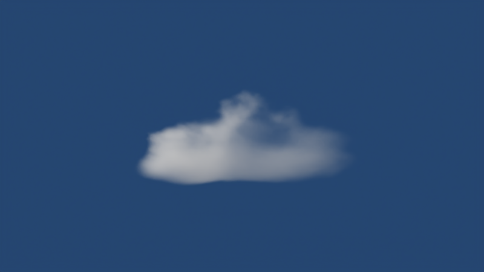 | 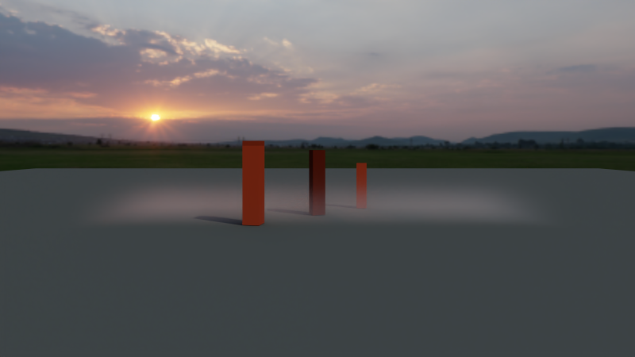 |

| Smoke | Standalone fire |
|:--:|:--:|
| 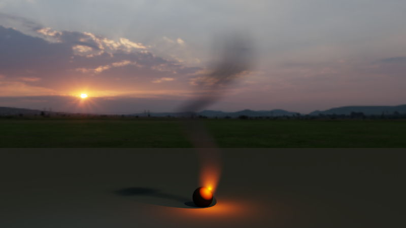 | 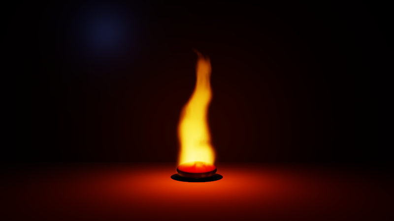 |

| Combined cloud, fog, smoke, and fire |
|:--:|
| 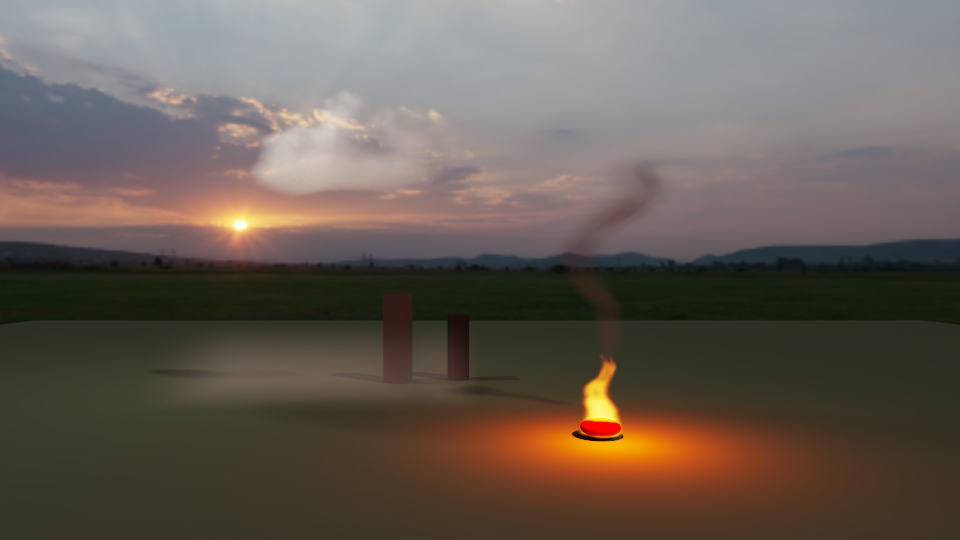 |

| Candle, 1024 spp | Wood fire, 1024 spp |
|:--:|:--:|
| 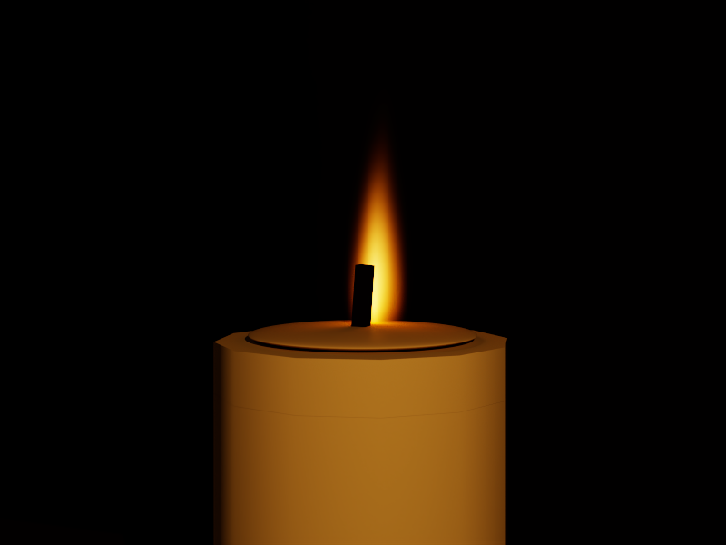 | 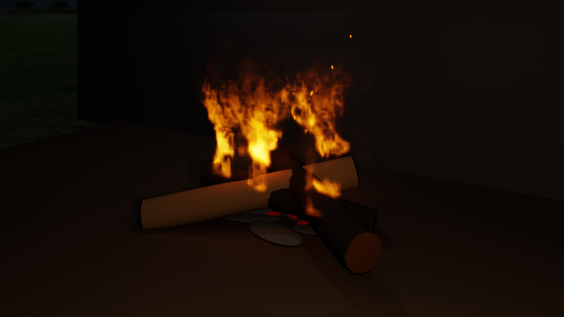 |

| Wildfire, 512 spp on a 192 x 160 x 160 field |
|:--:|
| 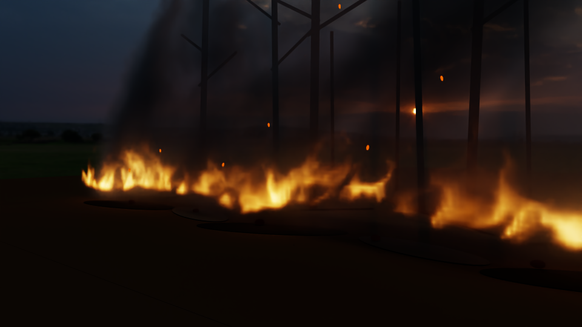 |

The static combustion scenes are:

- `scenes/jsons/volumetric/showcase_candle.json`
- `scenes/jsons/volumetric/showcase_wood_fire.json`
- `scenes/jsons/volumetric/showcase_wildfire.json`

These are the accepted post-audit static renders. Every scene has a denoised
display PNG, a non-denoised `.raw.png`, and a scene-linear Radiance `.hdr`.
The candle traced in 109.85 s, the wood fire in 308.95 s, and the wildfire in
264.87 s. Exact sizes and SHA-256 hashes are recorded in
`img/volumetric_fire_showcases_manifest.json`.

The ten final artifacts were published and metadata-verified in the requested
[Google Drive folder](https://drive.google.com/drive/folders/18TMgF1j5UxUOooPnN2XOiyb-8whefwUB).
The uploaded [manifest](https://drive.google.com/file/d/1GKIGmF8VjTXTinvtyTHJySjk_q4pMGEk/view?usp=drivesdk)
records the local byte sizes and SHA-256 hashes.

### Static sparse combustion fields

A deterministic semi-Lagrangian solve runs once at scene load and bakes one
static 3-D snapshot:

| Field | Rendering role |
|:--|:--|
| Density | Smoke/gas absorption and scattering |
| Soot | Strong absorption, weaker scattering, and hot-soot emission |
| Fuel | Source placement and diagnostics |
| Reaction | Thin emitting and absorbing combustion regions |
| Temperature | Planck blackbody color and HDR intensity |
| Velocity | Wind, buoyancy, coherent advection, and diagnostics |

Density, soot, fuel, and reaction share one float4 field. Temperature and
velocity share a second. Wind, buoyancy, and two divergence-free curl-noise
scales drive coherent advection with separate cooling and dissipation rates.

`Candle` injects heat and vapor around a compact wick. `WoodFire` uses localized
log-surface and gap sources. `Wildfire` builds an irregular fuel-attached front
with many short flames, occasional taller folds, and substantially more
downwind smoke. Char, ash, coal, vegetation, and ember geometry are static
context; they do not replace the flame volume.

### GPU storage and hardware filtering

This is a custom sparse-brick representation, not an OpenVDB/NanoVDB importer.
Each active brick owns `8^3` logical cells and a duplicated positive-side
`9^3` halo. A dense brick-resolution page table maps logical coordinates to
compact active-brick indices; `-1` means empty.

Active payloads are packed into two CUDA 3-D texture atlases, one float4 atlas
per field group. Each brick's atlas origin is precomputed. Runtime interpolation
uses two hardware-filtered `tex3D` operations, while the page table and brick
DDA still skip empty space. Per-brick halos prevent filtering between unrelated
atlas tiles.

Halo maxima receive an order-independent 26-neighbor expansion. Combining those
maxima with the active spectral coefficients and an outward-rounding margin
produces conservative local extinction majorants. The object's inverse
transform supplies the world-to-volume mapping.

A sparse grid is selected with `FIELD_MODEL: "SparseGrid"` on the medium and a
`VOLUME_GRID` block on its cube:

```json
{
  "TYPE": "cube",
  "MATERIAL": "combustion",
  "TRANS": [0.0, 4.0, 0.0],
  "ROTAT": [0.0, 0.0, 0.0],
  "SCALE": [8.0, 8.0, 4.0],
  "VOLUME_GRID": {
    "PRESET": "WoodFire",
    "RESOLUTION": [112, 128, 80],
    "SEED": 61,
    "WIND": [0.12, 0.10, -0.20],
    "DENSITY_SCALE": 1.0,
    "SOOT_SCALE": 1.0,
    "REACTION_SCALE": 1.0,
    "TURBULENCE_SCALE": 1.0,
    "BUOYANCY_SCALE": 1.0,
    "SMOKE_ADVECTION": 1.0
  }
}
```

Every resolution component must be positive and divisible by eight. Showcase
JSON files are the source of truth for tuned values.

### Optical model, transport, and lighting

At a filtered point:

```text
m = material-level DENSITY scale
sigma_a = m * (density * smokeSigmaA + soot * sootSigmaA
               + reaction * flameSigmaA)
sigma_s = m * (density * smokeSigmaS + soot * sootSigmaS)
sigma_t = sigma_a + sigma_s
```

Smoke uses the Henyey-Greenstein phase function. Stored temperature drives
analytic Planck blackbody emission in unclamped HDR; a temperature-gated soot
term supplies incandescent orange emission while cooler soot remains primarily
absorptive. An equal-energy illuminant double-normalization found during
cross-renderer validation was removed.

Camera and continuation rays use local-majorant delta tracking. Shadow rays use
ratio tracking with the same majorants and empty-brick skipping. Real medium
events use next-event estimation and power-heuristic MIS, including surface
visibility and ratio-tracked medium transmittance. Multiple volume scattering
is supported. Reference transport does not use fixed ray-march steps.

Homogeneous media with zero scattering use a variance-free Beer-Lambert GPU
fast path. Because no real scattering event can occur, the path continues with
`exp(-sigma_t * distance)` instead of sampling a terminate/escape Bernoulli
event. This preserves the estimator while substantially reducing soot noise
and work.

The grid builds an emitted-power CDF over active bricks and a cell CDF inside
each brick. Surface and medium vertices explicitly sample this extended 3-D
emitter. Embedded vertices mix the hierarchy with a bounded local inverse-square
proposal and evaluate the matching mixture PDF. Ordered stratified segment
emission handles camera and specular paths.

Surface emitters use a separate PBRT-style power-weighted CDF. The same
discrete PMF appears in NEE and hit-light MIS. Nonuniformly scaled emissive
spheres evaluate the exact affine local-to-world area Jacobian for their
conditional PDF.

Fire therefore illuminates logs, ash, vegetation, smoke, and other geometry
through path transport. Supplemental authored key/fill lights do not stand in
for the complete fire-lighting solution.

### Camera output, quality modes, and diagnostics

Radiance accumulates in an unclamped scene-linear HDR buffer. `--denoise`
filters a copy with OIDN; the original remains the source of `.hdr` and
`.raw.png`. The display path always applies exposure. With `TONEMAP: true`, it
then applies a fitted ACES curve and linear-sRGB to sRGB conversion; with
`TONEMAP: false`, it writes exposed, clamped linear RGB. No bloom, alpha-flame
glow, or screen-space heat wobble is baked into the shader.

`Reference` retains multiple scattering, delta/ratio tracking, and four
segment-emission strata per emissive brick. `Debug` limits real scattering
depth and uses one stratum. Fixed-step compositing is confined to field
visualization.

Available `--volume-debug` values are:

```text
none
temperature  density  fuel  soot  reaction  emission
sigma-a      sigma-s  sigma-t
velocity     majorant
null-rate    event-count
direct-volume  indirect-volume  surface-fire
```

With `VOLUME_STATS` enabled, headless output reports brick visits, empty skips,
collisions, majorant violations, and tracking overflows. Statistics storage and
atomics are absent when disabled.

### Validation and official-renderer comparisons

The registered CTest target has eleven internal groups covering preset
construction, interpolation, page-table and emission-PDF invariants,
conservative neighbor majorants, Beer-Lambert attenuation, the pure-absorption
fast path, coefficient identities, Henyey-Greenstein normalization and first
moment, Planck behavior, and malformed-resolution rejection. Controlled scenes
live under `scenes/jsons/volumetric/validation/`.

The project, Blender/Cycles, PBRT v4, and Mitsuba 3 were rendered with one
shared homogeneous-volume protocol: 320 x 320, 4096 spp, depth 12, seed
20260804, FOVY 28 degrees, camera `(0,0,5)`, a `[-1,1]^3` medium, black world,
and a 6 x 6 backlight at scene-linear radiance 4. Soot is absorption-only; fog
and smoke use separate absorption/scattering coefficients and HG anisotropy.
Every metric PNG was regenerated from raw linear HDR/EXR with the same PBRT
`imgtool --scale 0.25` conversion and no denoising.

| Medium | Reference | PSNR | SSIM | LPIPS |
|:--|:--|--:|--:|--:|
| Soot | Blender | 46.3783 dB | 0.994043 | 0.003233 |
| Soot | PBRT | 42.2976 dB | 0.958151 | 0.158097 |
| Soot | Mitsuba | 42.6118 dB | 0.964107 | 0.157157 |
| Fog | Blender | 48.2466 dB | 0.984537 | 0.006493 |
| Fog | PBRT | 46.2880 dB | 0.975498 | 0.000910 |
| Fog | Mitsuba | 47.3968 dB | 0.980979 | 0.002447 |
| Smoke | Blender | 44.4404 dB | 0.971469 | 0.101108 |
| Smoke | PBRT | 42.0947 dB | 0.947452 | 0.007550 |
| Smoke | Mitsuba | 42.6334 dB | 0.953728 | 0.008778 |

| Project and official 4096-spp references; identical framing and display conversion |
|:--:|
| 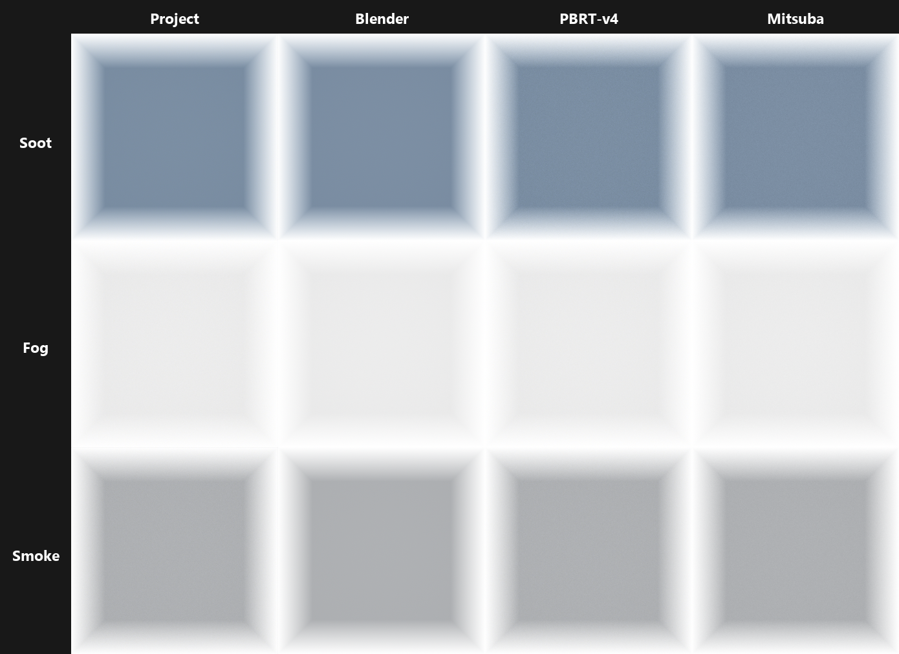 |

The complete comparison package is in the verified
[Smoke, Soot, and Fog reference subfolder](https://drive.google.com/drive/folders/1lPvs7WDBx4DI2KgV1qbjjme13Z943Xg4).
It contains 12 raw linear HDR/EXR renders, 12 normalized PNGs, the contact
sheet, three implementation audits, a validation report, and the
[machine-readable manifest](https://drive.google.com/file/d/1Qq8-YYq2MOqk5uMdOYNxigU0fT9AN9Vw/view?usp=drivesdk).
Drive metadata readback verified all 30 names, MIME types, parent IDs, and
12,962,727 bytes against the local package.

These numbers are aligned implementation comparisons, not realism scores.
They are comparable to the official-renderer pairwise spread; the weakest
project fog and smoke pairs are respectively 1.60 dB and 1.15 dB below the
weakest official pair, without a systematic shape or attenuation mismatch.
Project PNG/HDR repeats and PBRT pixels are exact; fixed-seed Cycles and
Mitsuba runs differ only by parallel floating-point reduction order (minimum
repeat PSNR 102.48 dB and 143.78 dB respectively), so cross metrics are
numerically reproducible.

```powershell
python .\scripts\compare_renders.py reference.png candidate.png --lpips
```

`compare_renders.py` requires NumPy, Pillow, and scikit-image; LPIPS also
requires PyTorch and `lpips`.

### Official renderer audit

| Renderer | Revision/runtime | Relevant result |
|:--|:--|:--|
| Blender/Cycles | Blender `d769b0ee1e3`; CLI 5.1.2, OptiX | Audited volume stacks, octree majorants, null scattering, equiangular/distance MIS, blackbody handling, and GPU integration. The analytic absorption behavior was adopted; guiding/equiangular sampling remains profile-gated future work. |
| Mitsuba 3 | `5f090a15`; Mitsuba 3.9.0, Dr.Jit 1.4.0, `cuda_ad_rgb` | Audited CUDA texture interpolation, homogeneous/heterogeneous media, HG, volume NEE/MIS, and null visibility. The project already implements these, with sparse local rather than global majorants. |
| PBRT v4 | `7154d82`; recursive CPU `volpath`, `imgtool` | Audited spectral coefficients, HG, NanoVDB/grid media, DDA majorants, null collisions, ratio tracking, and power-light sampling. No correctness port was missing; NanoVDB import remains optional interoperability work. |

PBRT v4 and audited Cycles files are Apache-2.0. Mitsuba 3 and Dr.Jit are
BSD-3-Clause. Blender application source remains GPL.

### Nsight performance

Precomputed atlas origins moved the temporary low-resolution wildfire's 16-spp
wall time from 8.57 s to 8.27 s. The final Systems report profiles the accepted
`192 x 160 x 160` wildfire field at 4 spp:
`.cache/official_repo_audit/nsys_wildfire_final_192grid_4spp.nsys-rep`.

| GPU work, final 192-grid scene at 4 spp | Time | Share |
|:--|--:|--:|
| `shade` | 1.748 s | 81.3% |
| `computeIntersections` | 0.244 s | 11.3% |
| CUB merge | -- | 5.9% |
| CUB block sort | -- | 0.8% |
| Compaction | -- | 0.3% |

The pure-absorption fast path reduced the aligned 320 x 320 soot render at
4096 spp from 160.83 s to 63.40 s (60.6%). In its post-port 64-spp Nsight
Systems trace, `shade` is 2.7% of GPU time while CUB merge sorting is 66.6%, so
additional volume-shader work is not the next bottleneck for absorption-only
media. The report is
`.cache/reference_validation/project/nsys_soot_absorption_fastpath_64spp.nsys-rep`.

Nsight Compute was attempted, but driver policy blocks counters with
`ERR_NVGPUCTRPERM`; no `.ncu-rep` is claimed.

### Static scope and limitations

- These are deterministic static combustion snapshots. Animation, grid-time
  interpolation, motion blur, dynamic fuel propagation, and ember trajectories
  are intentionally outside the requested still-image scope.
- OpenVDB/NanoVDB import and heat refraction are not implemented.
- Nested/overlapping media are unsupported; cameras starting inside media are
  rejected.
- Embers are statically authored emissive geometry, not runtime particles.
- Color-only OIDN can smooth low-SNR detail, so raw PNG and HDR must be reviewed.
- Wood and wildfire props are purpose-built low-poly context, not photographic
  vegetation.

### Reproducible commands

```powershell
.\scripts\build.bat
cmake --build .\build --config Release --target volume_grid_tests
ctest --test-dir .\build -C Release -R volume_grid_tests --output-on-failure
```

Quick controlled-scene sweep:

```powershell
$exe = ".\build\bin\Release\cis565_path_tracer.exe"
$tests = @(
  "homogeneous_absorption_cube", "homogeneous_emitting_sphere",
  "homogeneous_scattering_point", "heterogeneous_known_majorant",
  "blackbody_temperature_ramp", "backlit_smoke",
  "single_burning_log", "three_log_campfire",
  "grass_strip_wind", "wildfire_grid_fields"
)
foreach ($name in $tests) {
  & $exe ".\scenes\jsons\volumetric\validation\$name.json" `
    --headless --spp 1 --output ".\.cache\validation\$name"
}
```

Accepted beauty-render commands:

```powershell
$exe = ".\build\bin\Release\cis565_path_tracer.exe"
& $exe .\scenes\jsons\volumetric\showcase_candle.json `
  --headless --denoise --spp 1024 `
  --output .\img\volumetric_candle_showcase
& $exe .\scenes\jsons\volumetric\showcase_wood_fire.json `
  --headless --denoise --spp 1024 `
  --output .\img\volumetric_wood_fire_showcase
& $exe .\scenes\jsons\volumetric\showcase_wildfire.json `
  --headless --denoise --spp 512 `
  --output .\img\volumetric_wildfire_showcase
```

## Mesh Loading

The renderer supports `.obj`, `.gltf`, and `.glb` through TinyObjLoader and
TinyGLTF.

## Other Performance Notes

Russian roulette is controlled by `USE_RUSSIAN_ROULETTE` in
`src/render/pathtrace.cu`. The original
`scenes/jsons/test_performance/russianRoulette.json` benchmark measured
reductions of 10.36%, 16.93%, and 36.47% at 960, 5,760, and 23,040 triangles,
respectively. See
`img/extraCredit/Russian Roulette Performance Chart.png` for the original
chart. These historical surface-scene measurements are separate from the
current Nsight volume profile above.

# Resources

## Libraries

- [TinyObjLoader](https://github.com/tinyobjloader/tinyobjloader)
- [TinyGLTF](https://github.com/syoyo/tinygltf)
- [rgb2spec](https://github.com/mitsuba-renderer/rgb2spec)
- [PBRT v4](https://github.com/mmp/pbrt-v4)
- [Mitsuba 3](https://github.com/mitsuba-renderer/mitsuba3)
- [Blender/Cycles](https://github.com/blender/blender)

## Papers and implementations

### Spectral rendering

- Wilkie et al., [Hero Wavelength Spectral Sampling](https://cgg.mff.cuni.cz/publications/hero-wavelength-spectral-sampling/), EGSR 2014
- Jakob and Hanika, [A Low-Dimensional Function Space for Efficient Spectral Upsampling](https://rgl.epfl.ch/publications/Jakob2019Spectral), Eurographics 2019

### Volumetric rendering

- Miller, Georgiev, and Jarosz, [A Null-Scattering Path Integral Formulation of Light Transport](https://cs.dartmouth.edu/~wjarosz/publications/miller19null.html), SIGGRAPH 2019
- [PBRT v4, Volume Scattering Integrators](https://pbr-book.org/4ed/Light_Transport_II_Volume_Rendering/Volume_Scattering_Integrators)
- Woodcock et al., *Techniques Used in the GEM Code* (1965)
- Henyey and Greenstein, [Diffuse Radiation in the Galaxy](https://www.astro.umd.edu/~jph/HG_note.pdf) (1941)
- Novák, Selle, and Jarosz, [Residual Ratio Tracking](https://cs.dartmouth.edu/~wjarosz/publications/novak14residual.html), SIGGRAPH Asia 2014 — related work, not the current shadow estimator
- [NanoVDB](https://developer.nvidia.com/blog/accelerating-openvdb-on-gpus-with-nanovdb/) — audited as an alternative representation, not used here

## Art

### Models

- [Meshes Used in the Cover Image](https://poly.pizza/bundle/Bubbly-Bathroom-Set-eSvpFVB4Ft)

### Environment maps

- Showcase environments are stored under `scenes/textures/env/`.
